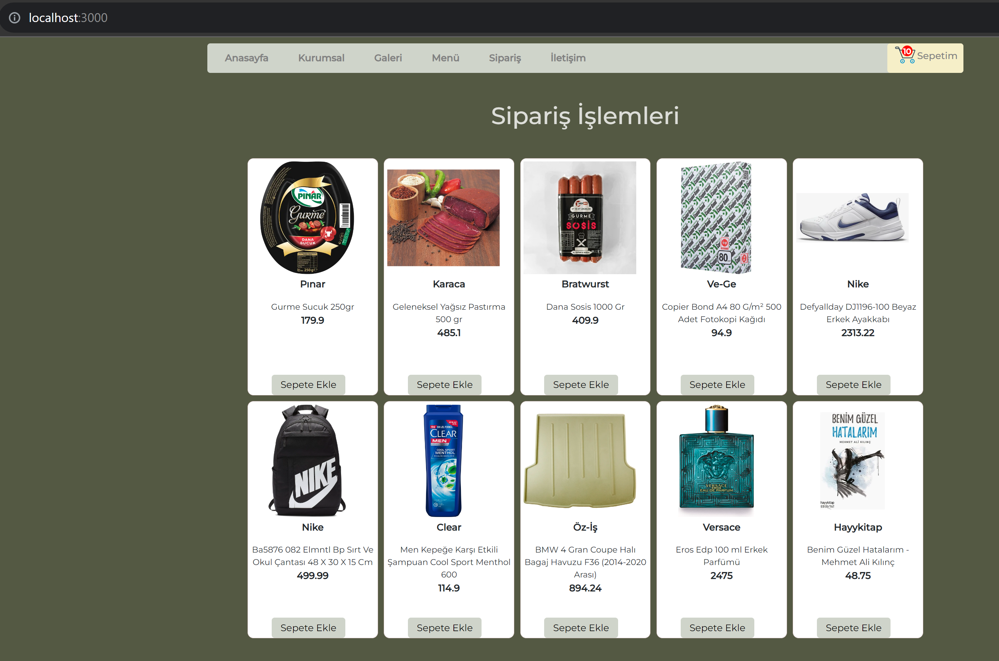

# SIMPLE ORDER FORM (Basit Sipariş Formu) #

<ul>
  <li>Basit sipariş formu sayfası için kullandığım teknolojiler: HTML, CSS, Javascript, React.  
    
  The technologies I used for the simple order form page: HTML, CSS, Javascript, React.
  </li>
  <li>Veritabanı kullanılmamıştır. Veriler proje sayfası içerisine eklenmiş ve buradan çekilerek kullanılmıştır. 
  
  No database was used. The data was added to the project page and used by pulling it from there.
  
  </li>
  <li>Css olarak pure css kullanılmıştır.

  Pure css is used as css.
  </li>
  <li>Bu projede react kütüphanesinin temel bileşenleriyle bir sayfa oluşturulmuştur.

  In this project, a page was created with the basic components of the react library.
  </li>
  <li>Ürünleri sepete ekleme, aynı zamanda sepetin içindeki ürün sayısını sepetin üstünde görüntüleme ve ürün sayısını localstorage'da tutma işlemleri yapılmıştır.

  Adding products to the basket, at the same time displaying the number of products in the basket on the basket and keeping the number of products in localstorage.
  
  </li>
  <li>Sayfadaki menü linkleri görüntü amaçlıdır. Bu linkler aktif değildir.
  
  Menu links on the page are for display purposes. These links are not active.
  </li>
  <li>Sepete eklenen ürünler console'a da yazdırılmıştır.
  
  Products added to the basket are also printed to the console.
  </li>  
</ul>

## Project gif file (Proje gif dosyası) ##

